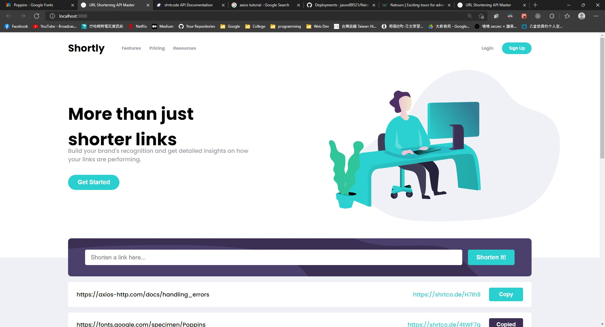

# Frontend Mentor - Shortly URL shortening API

This is a solution to the [Shortly URL shortening API Challenge challenge on Frontend Mentor](https://www.frontendmentor.io/challenges/url-shortening-api-landing-page-2ce3ob-G).

## Table of contents

- [Overview](#overview)
  - [The challenge](#the-challenge)
  - [Screenshot](#screenshot)
  - [Links](#links)

## Overview

### The challenge

Users should be able to:

- View the optimal layout for the site depending on their device's screen size
- Shorten any valid URL
- See a list of their shortened links, even after refreshing the browser
- Copy the shortened link to their clipboard in a single click
- Receive an error message when the `form` is submitted if:
  - The `input` field is empty

### Screenshot



### Links

- Solution URL: [GitHub](https://github.com/jason89521/URL-Shortening-API)
- Live Site URL: [GitHub Pages](https://jason89521.github.io/URL-Shortening-API/)

## Get Started

### Install dependencies

```command
yarn install
```
or
```command
npm install
```

### Run 

```command
yarn start
```
or
```command
npm start
```